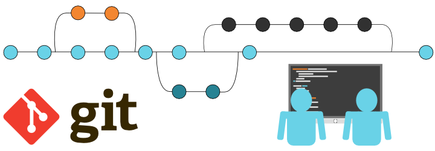

# __Знакомство с Git.__

> ## __Содержание:__
* Что такое контроль версий и зачем он нужен.
* Git - программа для контроля версий.
*Команды Git.
* Создание Git-репозитория.
* Зачем нужны ветви.
* Работа с черновиками.
* Совмещение двух вариантов текста.
* Удаление веток.
* Добавление изображения.
* Конфликт изменений.
* Визуализация всех веток.

>##  __Что такое контроль версий и зачем он нужен.__
### __Контроль версий (контроль исходного кода)__ — практика, которая позволяет отслеживать
изменения исходного кода и управлять ими.

__Рассмотрим практическую задачу.__

> Мы создали сайт, он работает, пользователи не испытывают проблем. Но прошло время и мы
решили изменить функциональность. Прежде чем вносить изменения, сохраняем рабочую версию
сайта на компьютере или сервере. Это будет архив «Рабочая версия нашего сайта». Спустя время
появляется еще одна версия нашего сайта, допустим, 2.0. При возникновении проблем всегда
можно откатиться до первой версии и запустить сайт заново.
### _Контроль версий необходим, чтобы:_
* _хранить разные версии проекта;_
* _возвращаться к разным версиям проекта._

_Примеры: версии сайтов (по датам) и документов._

Хранение версий сводится к созданию копий информации на компьютере или сервере.
Функцию возврата реализуют за счёт восстановления предыдущих версий.

Таким образом, __система контроля__ — это реализованная возможность замены информации
с использованием сохраненных версий.

>Когда вы работаете в команде, контроль версий помогает синхронизировать усилия.

### __Примеры использования контроля версий в жизни:__
 * Написание нескольких версий одного текста.

 * Сохранение в компьютерных играх.

>(Если вы сделали что-то неправильно, вы всегда можете вернуться к состоянию, когда вас всё устраивало).

 * Группа сотрудников пишет текст в течение
нескольких дней.

>(Когда готов первый черновик, его
отправляют на ревью коллеге. Пока он
читает, другие сотрудники продолжают
работу над текстом).

>## __Git - программа для контроля версий.__

В программировании проблемы совместной
работы над проектами возникли ещё до
появления облачных сервисов.

>__Git__ — самая популярная система контроля
версий, но не единственная. Алгоритм
работы подобных систем схож.

Программа Git берёт на себя контроль версий
проекта и позволяет переключаться между
ними. Обратите внимание: Git хранит __не файлы целиком, а отличия между ними__. Это позволяет экономить память. Автор программы — Линус Торвальдс, создатель ОС Linux.

>## __Команды Git.__

>## __Создание Git-репозитория.__

>## __Зачем нужны ветви.__

>## __Работа с черновиками.__

>## __Совмещение двух вариантов текста.__

>## __Удаление веток.__

>## __Добавление изображения.__

>## __Конфликт изменений.__

>## __Визуализация всех веток.__

__git log --graph__

Ключ -graf в связке с командой log позволяет отобразить коммиты в виде дерева.
